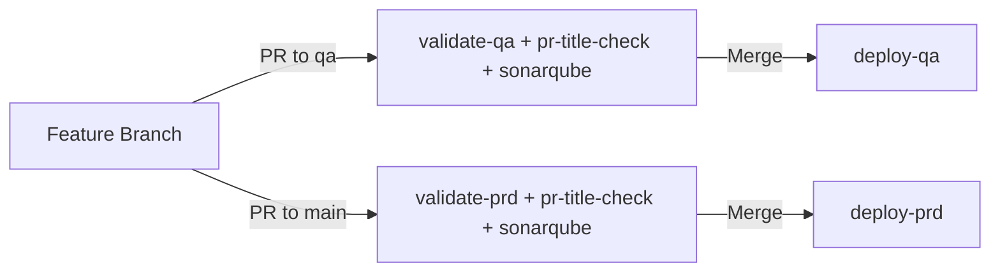
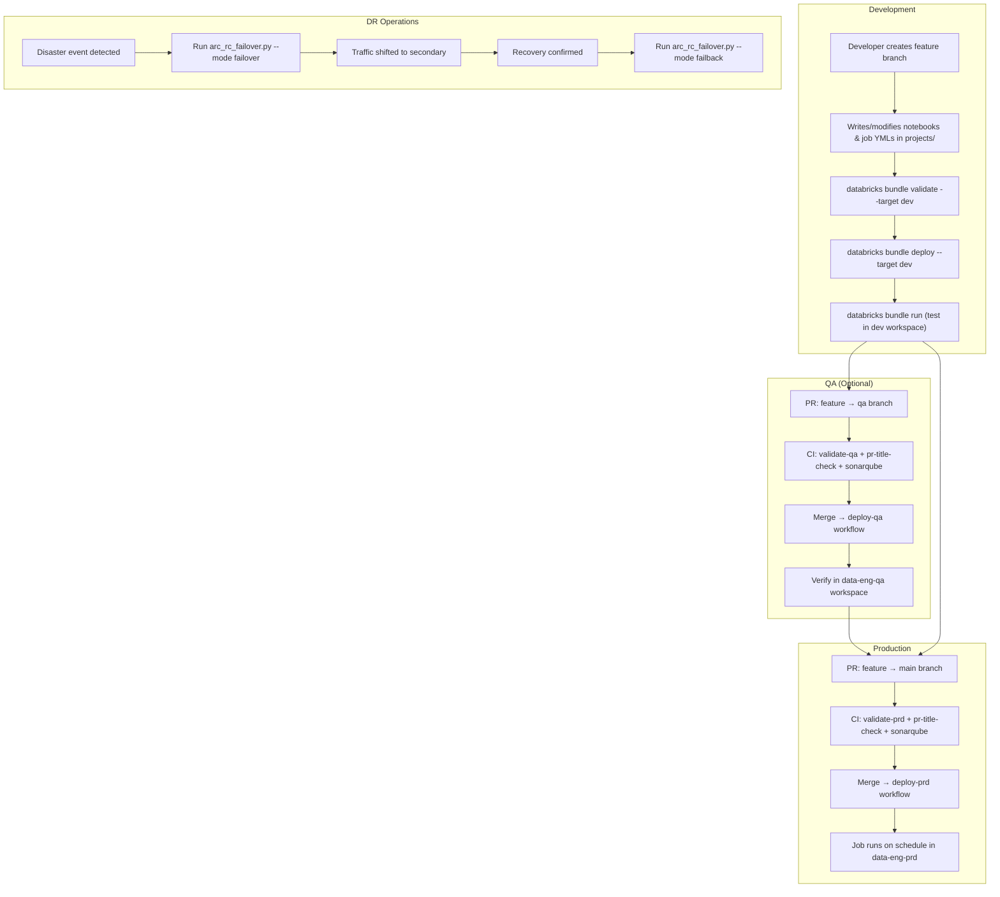

# Delta Lake Replication — Full Repository Walkthrough

## 1. What Is This Repo?

This is a **Databricks Asset Bundles (DABs)** project owned by the **Data SRE & FinOps** team at **FanDuel**. Its purpose is to manage **Delta Lake table replication** across Databricks workspaces — specifically performing **deep clone** operations to replicate tables between catalogs/schemas and providing **disaster recovery (DR) failover** tooling via AWS Route 53 ARC.

The repo follows a standard DABs template pattern with three deployment environments:

| Environment | Workspace | Branch trigger |
|---|---|---|
| **dev** | `fdg-data-eng-dev` | Local CLI (personal account) |
| **qa** | `fdg-data-eng-qa` | Merge into `qa` branch |
| **prd** | `fdg-data-eng-prd` | Merge into `main` branch |

---

## 2. Repository Structure

```
delta-lake-replication-main/
├── .configs/                          # Shared DAB variables (compute, storage, tags)
│   ├── compute.yml                    # Cluster policy IDs & service principal per env
│   ├── storage.yml                    # Catalog, schema, notifications per env
│   └── tags.yml                       # Resource tagging strategy
├── .github/                           # GitHub-level settings
│   ├── CODEOWNERS                     # Code review ownership rules
│   ├── pull_request_template.md       # PR template
│   └── workflows/                     # CI/CD GitHub Actions
│       ├── deploy-prd.yml             # Production deployment
│       ├── deploy-qa.yml              # QA deployment
│       ├── pr-title-check.yml         # JIRA ticket enforcement
│       ├── sonarqube.yml              # Code quality analysis
│       ├── validate-prd.yml           # PRD bundle validation (PR gate)
│       └── validate-qa.yml            # QA bundle validation (PR gate)
├── projects/                          # Databricks jobs & notebooks
│   ├── deep_clone_testing/            # The actual replication logic
│   │   ├── deep_clone_testing.job.yml
│   │   ├── deep_clone_testing_notebook.py
│   │   ├── deep_clone_testing_2.job.yml
│   │   └── deep_clone_testing_2_notebook.py
│   └── examples/                      # Template example files
│       ├── demo_dab_job.job.yml
│       └── demo_dab_notebook.py
├── scripts/                           # Local utility scripts (NOT deployed to Databricks)
│   ├── README.md
│   └── arc_rc_failover/               # DR failover tooling
│       ├── README.md
│       └── arc_rc_failover.py
├── databricks.yml                     # Core DAB bundle configuration
├── service.datadog.yaml               # Datadog service catalog entry
├── sonar-project.properties           # SonarQube project settings
└── .gitignore
```

---

## 3. Core Configuration — [databricks.yml](file:///c:/Users/samir/Desktop/antigravity-test/delta-lake-replication-main/delta-lake-replication-main/databricks.yml)

This is the **central Databricks Asset Bundle configuration**. It defines:

- **Bundle name**: `delta-lake-replication`
- **Includes**: Pulls in all `.yml` files from `projects/` and `.configs/` — this is how job definitions and shared variables get merged into the bundle.
- **Three targets**:
  - **`dev`** — Mode `development`, default target, deploys to `fdg-data-eng-dev`. Job triggers are paused. Resources get prefixed with `[dev <username>]`.
  - **`qa`** — Deploys to `fdg-data-eng-qa`. Runs as a service principal. Triggers paused.
  - **`prd`** — Mode `production`, enforces that deployment only comes from the `main` git branch. Deploys to `fdg-data-eng-prd`. Runs as a service principal. Triggers are **active** (not paused).

> [!IMPORTANT]
> Changes to `databricks.yml` require approval from **Core Data Infrastructure** before merging.

---

## 4. Shared Configuration — `.configs/`

These YAML files define **DAB variables** that are referenced throughout job definitions using `${var.<name>}` syntax.

### [compute.yml](file:///c:/Users/samir/Desktop/antigravity-test/delta-lake-replication-main/delta-lake-replication-main/.configs/compute.yml)

Defines **per-environment** values for:
- `cluster_policy_id` — The Databricks cluster policy that governs compute sizing/permissions (different IDs for dev/qa/prd).
- `service_principal_id` — The Azure AD service principal (`ba43c0af-9839-42f6-aeb2-93fa42181d3f`) used to run jobs. Same across all environments.

### [storage.yml](file:///c:/Users/samir/Desktop/antigravity-test/delta-lake-replication-main/delta-lake-replication-main/.configs/storage.yml)

Defines **per-environment** values for:
- `catalog` — Unity Catalog to use (currently `sandbox` in all envs)
- `schema` — Schema within the catalog (`data_sre_and_finops`)
- `notifications` — Email for failure alerts. In dev, uses `${workspace.current_user.userName}` (the developer's email). In qa/prd, uses the team DL `fdgdata-srefinops@fanduel.com`.
- `workspace` / `env` — Used for tagging resources.

### [tags.yml](file:///c:/Users/samir/Desktop/antigravity-test/delta-lake-replication-main/delta-lake-replication-main/.configs/tags.yml)

Defines a **complex variable** `tags` following FanDuel's Data Platform Tagging Strategy. Tags include:
- `team`, `team_email`, `bu` (business unit), `org`, `domain`, `vertical`
- `priority` (P4), `persona` (platform), `regulated_sox` (no)
- `layer` (non_ssot), `env` and `workspace` (dynamically resolved per target)

These tags are applied to all deployed resources via `presets.tags` in `databricks.yml`.

---

## 5. CI/CD — GitHub Actions Workflows

The repo uses **6 GitHub Actions workflows** for a robust CI/CD pipeline.

### Validation Workflows (PR Gates)

#### [validate-prd.yml](file:///c:/Users/samir/Desktop/antigravity-test/delta-lake-replication-main/delta-lake-replication-main/.github/workflows/validate-prd.yml)
- **Trigger**: PR opened/updated targeting `main`
- **Action**: Runs `databricks bundle validate --target prd`
- **Purpose**: Ensures the bundle config is valid for production *before* the PR is merged
- **Auth**: GitHub OIDC → Databricks service principal

#### [validate-qa.yml](file:///c:/Users/samir/Desktop/antigravity-test/delta-lake-replication-main/delta-lake-replication-main/.github/workflows/validate-qa.yml)
- **Trigger**: PR opened/updated targeting `qa`
- **Action**: Runs `databricks bundle validate --target qa`
- **Purpose**: Same as above but for the QA environment

### Deployment Workflows

#### [deploy-prd.yml](file:///c:/Users/samir/Desktop/antigravity-test/delta-lake-replication-main/delta-lake-replication-main/.github/workflows/deploy-prd.yml)
- **Trigger**: Push to `main` (i.e. PR merged)
- **Action**: Validates **then** deploys (`databricks bundle deploy --target prd`)
- **Concurrency**: Only 1 deployment at a time (global concurrency group)

#### [deploy-qa.yml](file:///c:/Users/samir/Desktop/antigravity-test/delta-lake-replication-main/delta-lake-replication-main/.github/workflows/deploy-qa.yml)
- **Trigger**: Push to `qa`
- **Action**: Validates **then** deploys (`databricks bundle deploy --target qa`)

### Quality Workflows

#### [pr-title-check.yml](file:///c:/Users/samir/Desktop/antigravity-test/delta-lake-replication-main/delta-lake-replication-main/.github/workflows/pr-title-check.yml)
- **Trigger**: PR opened/edited/synchronized
- **Action**: Validates the PR title matches the regex `^\[[A-Z]+-[0-9]+\].*$` — i.e., it must start with a JIRA ticket in brackets like `[DATA-1234] Fix clone job`
- **Purpose**: Enforces traceability from code changes to JIRA tickets

#### [sonarqube.yml](file:///c:/Users/samir/Desktop/antigravity-test/delta-lake-replication-main/delta-lake-replication-main/.github/workflows/sonarqube.yml)
- **Trigger**: Push to `main`/`qa`, or PR opened/synced/reopened
- **Action**: Runs SonarQube static analysis via `SonarSource/sonarqube-scan-action@v6`
- **Purpose**: Code quality and security scanning

### CI/CD Flow Diagram



All workflows authenticate via **GitHub OIDC** (`DATABRICKS_AUTH_TYPE: github-oidc`) using the same Databricks service principal client ID.

---

## 6. Projects — The Actual Data Jobs

### Project 1: `deep_clone_testing` (Main Business Logic)

This is the **core project** — it performs Delta Lake deep clone operations for table replication.

#### [deep_clone_testing.job.yml](file:///c:/Users/samir/Desktop/antigravity-test/delta-lake-replication-main/delta-lake-replication-main/projects/deep_clone_testing/deep_clone_testing.job.yml) — Explicit Table Mapping Job

- **Schedule**: `0 0 22 1,15 * ?` → Runs at **10 PM ET on the 1st and 15th** of every month (currently PAUSED)
- **Parameter**: `table_mapping` — a JSON dict mapping source→destination tables
  - Default example: clones `logging.databricks.workflows_tags` → `sandbox.data_sre_and_finops.logging_databricks_workflows_tags_deep_clone_testing`
- **Cluster**: Uses the environment-specific `cluster_policy_id`, node type `mgd-fleet.xlarge`, 1 worker

#### [deep_clone_testing_notebook.py](file:///c:/Users/samir/Desktop/antigravity-test/delta-lake-replication-main/delta-lake-replication-main/projects/deep_clone_testing/deep_clone_testing_notebook.py) — Explicit Mapping Notebook

This is a Databricks notebook (201 lines) that:

1. **Parses** the `table_mapping` JSON parameter
2. **For each source→destination pair**:
   - Reads the source table, counts rows, gets size via `DESCRIBE DETAIL`
   - Executes `CREATE OR REPLACE TABLE <dest> DEEP CLONE <source>`
   - Validates row counts match between source and destination
   - Captures metrics: row count, size (GB), file count, elapsed time, throughput (GB/min)
3. **Prints a summary** with totals and per-table metrics
4. **Fails the job** (raises exception) if any clone operations failed

Key class: `CloneResult` dataclass holding all metrics per clone operation.

#### [deep_clone_testing_2.job.yml](file:///c:/Users/samir/Desktop/antigravity-test/delta-lake-replication-main/delta-lake-replication-main/projects/deep_clone_testing/deep_clone_testing_2.job.yml) — Tag-Based Discovery Job

- **Schedule**: Same as above (10 PM ET, 1st & 15th, PAUSED)
- **Parameter**: `tag_key` (default: `dr_test`) — discovers tables to clone by searching for this tag in Unity Catalog
- **Cluster**: Same configuration

#### [deep_clone_testing_2_notebook.py](file:///c:/Users/samir/Desktop/antigravity-test/delta-lake-replication-main/delta-lake-replication-main/projects/deep_clone_testing/deep_clone_testing_2_notebook.py) — Tag-Based Discovery Notebook

This notebook (248 lines) is the **more advanced version**:

1. **Queries** `system.information_schema.table_tags` to find all tables with the given tag key
2. **Auto-generates destination names**: `catalog.schema.table` → `sandbox.data_sre_and_finops.catalog_schema_table` (underscores replace dots)
3. **Clones** each discovered table using the same deep clone + validation logic as notebook 1
4. **Reports** the same detailed metrics summary

> [!NOTE]
> The difference between the two jobs: **Job 1** takes an explicit JSON mapping of source→dest tables. **Job 2** dynamically discovers tables by searching Unity Catalog tags, making it more suitable for a tag-driven DR strategy.

### Project 2: `examples` (Template Demo)

#### [demo_dab_job.job.yml](file:///c:/Users/samir/Desktop/antigravity-test/delta-lake-replication-main/delta-lake-replication-main/projects/examples/demo_dab_job.job.yml)
A simple template job showing how to structure a DAB job definition. Passes `environment` and `demo_list` parameters.

#### [demo_dab_notebook.py](file:///c:/Users/samir/Desktop/antigravity-test/delta-lake-replication-main/delta-lake-replication-main/projects/examples/demo_dab_notebook.py)
A minimal 19-line notebook that creates an RDD of 1–10 and prints a widget parameter. Serves as a "hello world" for new team members.

---

## 7. Utility Scripts — `scripts/`

These are **locally-run** scripts, **NOT** deployed as Databricks jobs.

### [arc_rc_failover.py](file:///c:/Users/samir/Desktop/antigravity-test/delta-lake-replication-main/delta-lake-replication-main/scripts/arc_rc_failover/arc_rc_failover.py) — AWS Route 53 ARC DR Failover

A **108-line Python script** for disaster recovery traffic routing using AWS Route 53 Application Recovery Controller (ARC).

**Purpose**: Flip routing controls to redirect traffic between primary and secondary regions during a DR event.

**Two modes**:
| Mode | Sequence | Use case |
|---|---|---|
| `failover` | Secondary → **On**, then Primary → **Off** | Disaster: shift traffic to secondary |
| `failback` | Primary → **On**, then Secondary → **Off** | Recovery: shift traffic back to primary |

**Key design decisions**:
- Always turns the new target **ON first** before turning the old target **OFF** → avoids a "both-off" outage window
- Post-flip **validation**: reads back each routing control state and confirms it matches expectations
- `--dry-run` mode previews planned changes without calling AWS APIs
- Supports **multiple routing controls** per flag (space-separated ARNs)

**Functions**:
- `update_routing_control()` — Sets a single routing control to On/Off
- `get_routing_control_state()` — Reads current state of a routing control
- `validate_states()` — Post-flip verification loop
- `failover()` / `failback()` — Orchestrate the mode-specific transition
- `_apply()` — Core logic: On-first, Off-second ordering
- `_client()` — Creates boto3 client with the ARC cluster endpoint

**Requires**: `boto3`, AWS credentials with `route53-recovery-cluster:UpdateRoutingControlState` and `GetRoutingControlState` permissions.

---

## 8. Observability & Quality

### [service.datadog.yaml](file:///c:/Users/samir/Desktop/antigravity-test/delta-lake-replication-main/delta-lake-replication-main/service.datadog.yaml)
Registers the service in **Datadog's Service Catalog** (schema v2.2):
- Service name: `delta-lake-replication`
- Team: `data-sre-and-finops`
- Tier: **P4** (low priority), Lifecycle: **experimental**
- Slack channel: `data-sre-and-finops-public`
- Tags: `kind:library`, `division:fd`, `domain:data`, `vertical:data-platform`
- Links to the GitHub repo and the deploy-prd workflow

### [sonar-project.properties](file:///c:/Users/samir/Desktop/antigravity-test/delta-lake-replication-main/delta-lake-replication-main/sonar-project.properties)
SonarQube/SonarCloud configuration:
- Project key: `fanduel_delta-lake-replication`
- Organization: `fanduel`

---

## 9. GitHub Configuration

### [CODEOWNERS](file:///c:/Users/samir/Desktop/antigravity-test/delta-lake-replication-main/delta-lake-replication-main/.github/CODEOWNERS)
- **All files** (`*`): Require review from `@fanduel/data-sre-and-finops` OR `@fanduel/core-data-infrastructure`
- `databricks.yml`, `.github/workflows`, `.configs`: Require **additional** review from `@fanduel/core-data-infrastructure`

### [pull_request_template.md](file:///c:/Users/samir/Desktop/antigravity-test/delta-lake-replication-main/delta-lake-replication-main/.github/pull_request_template.md)
Simple PR template asking for: Vertical, Team, What (description), Why (reason + JIRA tickets).

### [.gitignore](file:///c:/Users/samir/Desktop/antigravity-test/delta-lake-replication-main/delta-lake-replication-main/.gitignore)
Ignores: `.databricks/` (local state), `.vscode/`, `.venv/`, `typings/`

---

## 10. End-to-End Workflow Summary



---

## 11. Key Takeaways

| Aspect | Detail |
|---|---|
| **Primary purpose** | Replicate Delta Lake tables via deep clone for DR/testing |
| **Technology** | Databricks Asset Bundles (DABs) on AWS |
| **Team** | Data SRE & FinOps at FanDuel |
| **Environments** | dev → qa → prd (3 Databricks workspaces) |
| **Auth** | GitHub OIDC → Databricks service principal |
| **CI/CD** | GitHub Actions: validate on PR, deploy on merge |
| **Replication approaches** | 1) Explicit JSON table mapping 2) Tag-based auto-discovery |
| **DR tooling** | AWS Route 53 ARC routing control failover/failback |
| **Observability** | Datadog service catalog + SonarQube code analysis |
| **Code governance** | CODEOWNERS enforces Core Data Infra review for infra changes |
