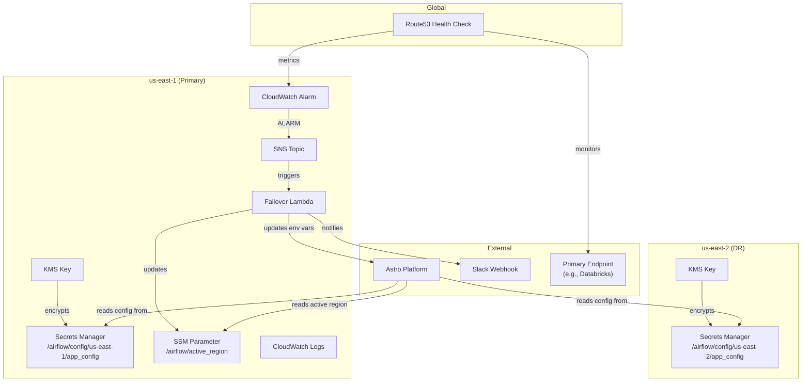

# Astro Airflow DR Failover — Terraform Infrastructure

Production-ready Terraform IaC for managing AWS multi-region disaster recovery infrastructure that supports Astronomer (Astro) Airflow failover.

## Architecture



## How Auto-Failover Works

1. **Route53 Health Check** monitors the primary region endpoint (e.g., Databricks workspace) every 30 seconds
2. **CloudWatch Alarm** triggers when the health check fails for 2 consecutive evaluation periods (2 minutes)
3. **SNS Topic** receives the alarm and fans out to:
   - **Failover Lambda** — performs the automated failover
   - **Email subscription** — notifies the on-call team (optional)
4. **Failover Lambda** executes:
   - Reads current active region from SSM Parameter `/airflow/active_region`
   - Switches the value to the DR region
   - Updates Astro deployment environment variables (if configured)
   - Sends a detailed Slack notification with failover details
5. **Recovery Detection**: When the health check recovers (alarm → OK), Lambda sends a recovery notification but does **NOT** auto-failback — manual failback via Airflow DAG is recommended

## Prerequisites

- [Terraform](https://www.terraform.io/downloads) >= 1.3
- [AWS CLI](https://aws.amazon.com/cli/) configured with appropriate credentials
- AWS IAM permissions for:
  - Secrets Manager, KMS, SSM, Lambda, IAM, CloudWatch, Route53, SNS
- Slack incoming webhook URL (for notifications)
- (Optional) Astronomer API key and deployment ID

## Quick Start

### 1. Clone and Configure

```bash
cd samir_test_variable_terraform
cp terraform.tfvars.example terraform.tfvars
# Edit terraform.tfvars with your actual values
```

### 2. Initialize Terraform

```bash
terraform init
```

### 3. Review the Plan

```bash
terraform plan
```

### 4. Apply

```bash
terraform apply
```

## Module Descriptions

| Module | Path | Description |
|--------|------|-------------|
| **secrets** | `modules/secrets/` | Creates KMS key (with rotation) and Secrets Manager secret per region. Stores Airflow config values (databricks_url, s3_bucket, kafka_bootstrap, etc.). |
| **ssm** | `modules/ssm/` | Creates SSM Parameter `/airflow/active_region` to track which region is currently active. Uses `lifecycle { ignore_changes }` to prevent Terraform from overriding Lambda-set values. |
| **health_check** | `modules/health_check/` | Route53 health check monitoring primary endpoint, CloudWatch alarm, SNS topic with optional email subscription. |
| **failover_lambda** | `modules/failover_lambda/` | Python Lambda function for auto-failover. Triggered by SNS, updates SSM, notifies Slack, optionally updates Astro. |

## Variables

| Variable | Type | Default | Required | Description |
|----------|------|---------|----------|-------------|
| `project` | string | `"airflow-dr"` | No | Project name for resource naming and tagging |
| `environment` | string | `"prod"` | No | Deployment environment (dev/staging/prod) |
| `primary_region` | string | `"us-east-1"` | No | AWS primary region |
| `dr_region` | string | `"us-east-2"` | No | AWS disaster recovery region |
| `secret_name_template` | string | `"/airflow/config/%s/app_config"` | No | Template for secret names (%s = region) |
| `primary_config` | map(string) | `{}` | No | Config key-value pairs for primary region |
| `dr_config` | map(string) | `{}` | No | Config key-value pairs for DR region |
| `health_check_fqdn` | string | — | **Yes** | FQDN to health check (e.g., Databricks URL) |
| `health_check_port` | number | `443` | No | Health check port |
| `health_check_path` | string | `"/api/2.0/clusters/list"` | No | Health check HTTP path |
| `health_check_type` | string | `"HTTPS"` | No | Health check type (HTTP/HTTPS/TCP) |
| `slack_webhook_url` | string | — | **Yes** | Slack webhook URL (sensitive) |
| `astro_api_key` | string | `""` | No | Astro API key (sensitive) |
| `astro_deployment_id` | string | `""` | No | Astro deployment ID |
| `notification_email` | string | `""` | No | SNS email subscription |
| `kms_deletion_window` | number | `10` | No | KMS key deletion window (7-30 days) |
| `secret_recovery_window` | number | `7` | No | Secret recovery window (7-30 days) |
| `tags` | map(string) | `{}` | No | Additional tags for all resources |

## Outputs

| Output | Description |
|--------|-------------|
| `primary_secret_arn` | ARN of the primary region Secrets Manager secret |
| `dr_secret_arn` | ARN of the DR region Secrets Manager secret |
| `primary_kms_key_arn` | ARN of the primary region KMS key |
| `dr_kms_key_arn` | ARN of the DR region KMS key |
| `health_check_id` | Route53 health check ID |
| `failover_lambda_arn` | Auto-failover Lambda function ARN |
| `sns_topic_arn` | SNS topic ARN for failover alerts |
| `ssm_parameter_name` | SSM parameter name (`/airflow/active_region`) |
| `active_region_ssm_arn` | SSM parameter ARN |

## Testing Failover

### Simulate a Failover

1. **Set CloudWatch alarm to ALARM state** (for testing):
   ```bash
   aws cloudwatch set-alarm-state \
     --alarm-name "airflow-dr-prod-primary-health-alarm" \
     --state-value ALARM \
     --state-reason "Testing failover" \
     --region us-east-1
   ```

2. **Verify SSM parameter was updated**:
   ```bash
   aws ssm get-parameter \
     --name "/airflow/active_region" \
     --region us-east-1 \
     --query "Parameter.Value" \
     --output text
   ```

3. **Check Slack** for the failover notification

4. **Manual failback** (when primary is healthy again):
   ```bash
   aws ssm put-parameter \
     --name "/airflow/active_region" \
     --value "us-east-1" \
     --type String \
     --overwrite \
     --region us-east-1
   ```

### Invoke Lambda Directly

```bash
aws lambda invoke \
  --function-name "airflow-dr-prod-failover" \
  --payload '{"Records":[{"Sns":{"Message":"{\"NewStateValue\":\"ALARM\",\"NewStateReason\":\"Manual test\"}"}}]}' \
  --region us-east-1 \
  output.json && cat output.json
```

## Security Considerations

- **KMS Encryption**: All secrets are encrypted with dedicated KMS keys per region with automatic key rotation enabled
- **Sensitive Variables**: `slack_webhook_url` and `astro_api_key` are marked as `sensitive` in Terraform — they won't appear in plan output or state diffs
- **Least Privilege IAM**: Lambda role has only `ssm:GetParameter`, `ssm:PutParameter`, and CloudWatch Logs permissions
- **State Encryption**: Use the S3 backend with `encrypt = true` and DynamoDB locking in production (see `backend.tf`)
- **Secret Recovery Window**: Configurable deletion protection (7-30 days) prevents accidental permanent secret deletion
- **No Auto-Failback**: Recovery is detected but does not auto-failback to prevent flapping — requires manual confirmation

## Cost Estimate

| Resource | Approximate Monthly Cost |
|----------|--------------------------|
| Route53 Health Check | ~$0.75 |
| CloudWatch Alarm | ~$0.10 |
| SNS Topic | ~$0.00 (free tier) |
| Lambda Function | ~$0.00 (free tier, invoked rarely) |
| KMS Keys (×2) | ~$2.00 |
| Secrets Manager (×2) | ~$0.80 |
| SSM Parameter | ~$0.00 (free tier) |
| CloudWatch Logs | ~$0.50 (varies) |
| **Total** | **~$4.15/month** |

## Troubleshooting

### Health Check Failing Immediately

- Verify `health_check_fqdn` resolves to a valid IP
- Ensure `health_check_path` returns HTTP 2xx/3xx
- Check if the endpoint allows Route53 health checker IPs (see [AWS docs](https://docs.aws.amazon.com/Route53/latest/DeveloperGuide/route-53-ip-addresses.html))

### Lambda Not Triggering

- Verify SNS topic subscription is confirmed
- Check CloudWatch Logs: `/aws/lambda/airflow-dr-prod-failover`
- Ensure Lambda has permission to be invoked by SNS

### SSM Parameter Not Updating

- Check Lambda IAM role has `ssm:PutParameter` permission
- Verify the SSM parameter name matches in Lambda env vars

### Slack Notifications Not Arriving

- Verify the webhook URL is valid and the Slack app is installed
- Check Lambda CloudWatch Logs for `Slack notification failed` errors
- Ensure Lambda has outbound internet access (default in non-VPC configuration)

## Cleanup

```bash
terraform destroy
```

> **Note**: KMS keys and Secrets Manager secrets have deletion protection windows. They will be scheduled for deletion but not immediately removed.

## License

Internal use only. All rights reserved.
